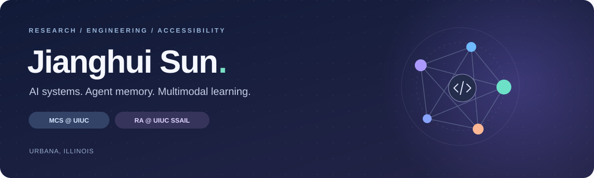

  

  
  &nbsp;
  
  &nbsp;
  

  <b>Exploring how AI systems serve, remember, and understand.</b> 
  MCS student at the University of Illinois Urbana-Champaign. 
  Working across efficient LLM inference, agent memory, and accessible multimodal AI.

## 🟣 Current research

<table>
<tr>
<td width="50%" valign="top">

### LLM inference systems

**UIUC SSAIL · Research Assistant**  
🟢 **Ongoing**

Assisting with system optimizations for **prefill/decode (P/D)-disaggregated LLM inference** for multi-turn agentic tasks.

`LLM serving` `P/D disaggregation` `Agentic workloads`

</td>
<td width="50%" valign="top">

### Agent memory evolution

**UIUC · CS546 team research project**  
🟢 **In progress**

Investigating whether **knowledge organization** helps agents learn to revise stale memories while preserving valid information.

`Agent memory` `Reinforcement learning` `Evaluation`

</td>
</tr>
</table>

<b>Inside the CS546 project — research question & evaluation plan</b>

**Knowledge Organization for Agent Memory Evolution** compares flat and semantically organized views of the same memory bank, with matched content, evidence, and feedback budgets.

- **Question:** Does knowledge organization improve learning gains and sample efficiency for selective memory revision?
- **Planned evaluation:** Reinforcement-learning gains, correction behavior, and preservation of valid knowledge.
- **Benchmarks in the evaluation plan:** STALE, AgentStream, and MemoryAgentBench.
- **Controls:** Separate the effect of semantic structure from generic grouping.

This is ongoing team research; the evaluation plan is not a claim of completed results.

## 🔵 Research & engineering experience

### Vision-language understanding

**Research Assistant · Xi’an Jiaotong-Liverpool University** · Nov 2025–Jan 2026

Built a fine-grained emoji understanding framework using **DINOv2 + Qwen-VL**. Designed adapter-based alignment modules to connect visual representations with the language decoder and describe subtle facial expressions.

### Emotion-aware multimodal agents

**Research Assistant · Xi’an Jiaotong-Liverpool University** · Sep–Nov 2025

Developed **EmoSound**, an agent for emotion-aligned audio accompaniment of emoticons. Fine-tuned CLIP with cross-attention soft prompts and integrated multimodal retrieval with audio generation for visually impaired users.

### Air quality forecasting

**ML Algorithm Engineering Intern · RocKontrol Technology Group** · Jun–Aug 2024

Built multi-horizon forecasting models using **40k+ records** of air quality, emissions, and weather data. Compared RNN, LSTM, GRU, and Transformer models in PyTorch.

> **~12% lower RMSE** with LSTM versus the baseline RNN, with the most stable performance across 6-, 12-, and 24-hour forecast horizons.

## 🟠 Selected builds

| Project | What I built | Focus |
| :--- | :--- | :--- |
| **Cross-modal Audio Generation** Jun–Sep 2025 | A web application that generates emotion-aligned audio from images using training-free multimodal RAG, a cross-modal knowledge graph, dual-vector databases, and Qwen-based aggregation. | `Multimodal RAG` `Accessibility` |
| **Daily Reading Tracker** Mar–Jun 2025 | The core reading-log module across the front end and back end of a deployed full-stack Java application, with technical documentation. | `Java` `Full-stack` |

[Explore my portfolio →](https://gary22222222.github.io/cs409-mp0/#projects)

## 🟢 Technical toolkit

**Also work with:** Computer Vision · NLP · LLMs · Jupyter · Postman · n8n

View the toolkit as text

- **Languages:** Python, Java, C++, JavaScript, SQL
- **AI / ML:** PyTorch, Transformers, scikit-learn, Computer Vision, NLP, LoRA/PEFT, LLMs, RAG, LangChain
- **Backend & tools:** FastAPI, Spring Boot, REST APIs, Docker, Git, GitHub, Jupyter, Postman, n8n

## 🟣 Publication

**EmoSound: A Multimodal AI Agent Framework for Emotion-Aware Audio Accompaniment of Emoticons**

**Sun, J.**, et al. · *Advances in Brain-Inspired Cognitive Systems*  
Lecture Notes in Computer Science, Vol. 16568 · Springer, 2026

🟣 **Accepted for publication; forthcoming** &nbsp; · &nbsp; Presented at **BICS 2025**

## 🎓 Education

| | Degree | Timeline |
| :--- | :--- | :--- |
| **University of Illinois Urbana-Champaign** | Master of Computer Science | Aug 2026–Expected Dec 2027 |
| **Xi’an Jiaotong-Liverpool University** | B.Sc. in Information and Computing Science **GPA 3.8 / 4.0** | Sep 2022–Jul 2026 |

---

  <b>Let’s connect.</b> 
  LLM systems · Agent memory · Multimodal AI  
  <a href="mailto:sun112@illinois.edu">sun112@illinois.edu</a> &nbsp; / &nbsp;
  <a href="https://gary22222222.github.io/cs409-mp0/">Personal website</a>

